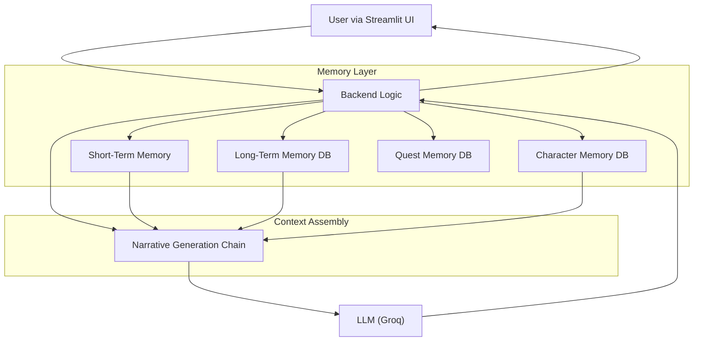

# 🤖 AI Dungeon Master

Welcome to the AI Dungeon Master, an interactive text-based RPG powered by a Large Language Model (LLM) with a persistent, multi-layered memory system. This project allows you to embark on dynamic adventures where the world and its inhabitants remember your actions.

Video Demo- [https://drive.google.com/file/d/1HbjGHnX1QaEV-Dsk1_ozXzBJgVDvh5eh/view?usp=sharing](https://drive.google.com/file/d/1HbjGHnX1QaEV-Dsk1_ozXzBJgVDvh5eh/view?usp=sharing)

---

## ✨ Features

* **🧠 Dynamic Narrative Generation**: The story is generated in real-time by an LLM, reacting to your every action.
* **💾 Multi-Layered Persistent Memory**: The AI remembers past events, ensuring long-term consistency in the storyline.
* **👤 Character-Specific Memory**: Non-Player Characters (NPCs) have their own dedicated memories. They will remember their previous interactions with you, and their personality and knowledge will evolve.
* **📜 Quest & Achievement Tracking**: The system automatically identifies and logs your major accomplishments and active quests. You can view your progress anytime.
* **💬 Simple & Interactive UI**: Built with Streamlit for a clean, user-friendly chat experience.

---

## 🏛️ Architecture Overview

The application is built on a modular architecture that separates the user interface, core logic, and different memory systems. This design ensures that each component is specialized and efficient.



1.  **UI (`app.py`)**: The Streamlit frontend captures user input and displays the story.
2.  **Backend (`backend.py`)**: The central hub that orchestrates the entire process. It receives input, assembles context from various memory sources, and calls the LLM.
3.  **Memory Modules**:
    * **Long-Term Memory**: A Chroma vector database that stores concise summaries of every turn, providing general context of past events.
    * **Character Memory (`character_memory.py`)**: A dedicated Chroma DB for NPCs. Each memory is tagged with an NPC's name, allowing the AI to recall specific interactions.
    * **Quest Memory (`quest.py`)**: A third Chroma DB that logs quests and achievements as they are identified by the LLM.

---

## ⚙️ How It Works

When a user enters an action, the system performs the following steps:

1.  **Context Retrieval**: The backend fetches relevant information from the memory layers:
    * The last few turns from **short-term memory**.
    * Key past events from the **long-term memory** vector store.
    * If an NPC is mentioned, their specific memories are retrieved from the **character memory** store.
2.  **Prompt Engineering**: The retrieved context is dynamically inserted into a prompt that instructs the LLM on how to continue the story, maintain consistency, and role-play as an NPC if necessary.
3.  **Narrative Generation**: The fully assembled prompt is sent to the Groq LLM API, which generates the next part of the narrative.
4.  **Memory Update**: After the turn is complete, the system updates its memory:
    * A summary of the turn is generated and saved to the **long-term memory DB**.
    * If an NPC was involved, their personality or relationship development is summarized and saved to their **character memory DB**.
    * The LLM checks if a new quest or milestone was achieved, and if so, adds it to the **quest memory DB**.

---

## 🛠️ Tech Stack

* **Framework**: Streamlit
* **LLM**: Groq (Llama 3.1 8B)
* **AI / NLP**: LangChain
* **Vector Database**: ChromaDB
* **Embeddings**: Hugging Face `all-MiniLM-L6-v2`
* **Language**: Python

---

## 🚀 Getting Started

Follow these steps to set up and run the project locally.

### 1. Prerequisites

* Python 3.8+
* Git

### 2. Installation

First, clone the repository to your local machine:
```bash
git clone [https://github.com/iShreyanshKumar/ai-dungeon-master.git](https://github.com/iShreyanshKumar/ai-dungeon-master.git)
cd ai-dungeon-master
```

Next, create a virtual environment and install the required dependencies:
```bash
# Create a virtual environment
python -m venv venv

# Activate it (Windows)
venv\Scripts\activate
# Activate it (macOS/Linux)
source venv/bin/activate

# Install packages
pip install -r requirements.txt
```

### 3. Environment Variables

You need a Groq API key to run the application.

1.  Create a file named `.env` in the root of the project directory.
2.  Add your API key to the file:

```env
GROQ_API_KEY="your-groq-api-key-here"
```

### 4. Usage

To run the application, execute the following command in your terminal:
```bash
streamlit run app.py
```
Open your web browser and navigate to the local URL provided by Streamlit. Start your adventure!

---

## 📂 Project Structure

```
.
├── app.py                  # Main Streamlit application file (UI)
├── backend.py              # Core logic, LLM chains, and summarization
├── character_memory.py     # Manages NPC-specific memories
├── quest.py                # Manages quest and achievement memories
├── requirements.txt        # Project dependencies
└── .env                    # Environment variables (API keys)
```

---
